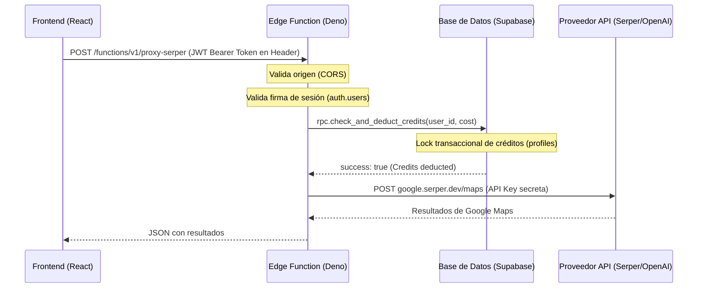

# 🔌 Referencia de APIs y Edge Functions - MapRanker Pro

Este documento describe la arquitectura de comunicación cliente-servidor de **MapRanker Pro**, detallando la estructura de las Edge Functions de Supabase (proxies), el flujo de autenticación mediante JSON Web Tokens (JWT), el cobro de créditos transaccionales y los mecanismos de bloqueo concurrente implementados en el cliente.

---

## 🏗️ Arquitectura de Seguridad "Zero-Key"

Para evitar la filtración de credenciales pagadas (OpenAI, Serper, DataForSEO, Google Maps), MapRanker Pro implementa un patrón de diseño **Zero-Key** en el cliente:

1. El frontend **nunca** almacena llaves de API externas ni las envía en el código compilado.
2. Todo el tráfico de integración se centraliza en **Supabase Edge Functions** (Deno).
3. Las Edge Functions leen las API keys desde las variables de entorno seguras de Supabase (`supabase secrets`).
4. Las llamadas se protegen mediante autenticación JWT y validación CORS.

---

## 🔒 Flujo de Autenticación y Autorización

Todas las peticiones del frontend a las Edge Functions siguen este flujo:



### 1. Validación de Orígenes (CORS Dinámico)
Las Edge Functions rechazan cualquier petición que provenga de un dominio que no esté en la lista blanca de producción o local (`localhost`), devolviendo un código de error **403 Forbidden**.

### 2. Validación de Sesión JWT
El helper `invokeEdgeFunction` extrae el `access_token` del usuario autenticado en la sesión de Supabase y lo inyecta en el encabezado `Authorization: Bearer <token>`. La Edge Function verifica que el JWT sea válido a través del validador de Supabase en Deno.

---

## 🚀 Proxies de Edge Functions Disponibles

Todas las Edge Functions se invocan mediante el helper centralizado en el frontend:
```ts
import { invokeEdgeFunction } from '@/lib/edgeFunctions';
```

### 1. `proxy-serper`
Redirige llamadas hacia los servicios de **Serper.dev** para obtener los listados de resultados reales de Google Maps y búsquedas web.
*   **Costo**: 1 crédito por punto de búsqueda.
*   **Parámetros de Solicitud (JSON)**:
    ```json
    {
      "endpoint": "maps", // Opciones: "maps" | "search"
      "payload": {
        "q": "restaurantes madrid",
        "gl": "es",
        "hl": "es",
        "ll": "40.4168,-3.7038"
      }
    }
    ```
*   **Respuesta**: Estructura JSON cruda devuelta directamente por Serper API.

### 2. `proxy-openai`
Redirige prompts de optimización SEO hacia los modelos de procesamiento de lenguaje natural de **OpenAI**.
*   **Costo**: 2 créditos por análisis.
*   **Parámetros de Solicitud (JSON)**:
    ```json
    {
      "prompt": "Optimiza esta ficha de negocio...",
      "systemPrompt": "Eres un consultor experto en SEO Local..."
    }
    ```
*   **Respuesta**:
    ```json
    {
      "choices": [
        {
          "message": {
            "content": "Texto optimizado generado por la IA..."
          }
        }
      ]
    }
    ```

### 3. `proxy-dataforseo`
Permite obtener volumen de búsqueda local,CPC, dificultad de palabras clave locales e historial de rankings orgánicos nacionales de competidores.
*   **Costo**: Configurado dinámicamente según el endpoint consultado (Labs, Keywords Data, SERP).
*   **Parámetros de Solicitud (JSON)**:
    ```json
    {
      "endpoint": "keywords_for_keywords", // Endpoint específico de DataForSEO
      "payload": { ... }
    }
    ```

### 4. `proxy-places`
Permite la búsqueda predictiva y autocompletado de ubicaciones de Google (Google Places) sin revelar la clave pública de Google Maps API.
*   **Costo**: Sin coste de créditos (protegido temporalmente para prospección comercial).
*   **Parámetros de Solicitud (JSON)**:
    ```json
    {
      "endpoint": "autocomplete", // Opciones: "autocomplete" | "details"
      "payload": {
        "input": "Narbos Salon",
        "types": ["establishment"]
      }
    }
    ```

---

## ⚡ Lógica de Bloqueos Concurrentes (Client-Side Armor)

Para mitigar fugas de presupuesto derivadas de clics accidentales concurrentes en elementos asíncronos que consumen créditos, el frontend implementa dos hooks defensivos:

### 1. `useAsyncLock`
*   **Uso**: Envuelve funciones de un solo disparo (ej: botón de enviar formulario de escaneo).
*   **Funcionamiento**: Bloquea el hilo del botón en un estado de carga síncrono. Los clics impacientes posteriores durante la petición asíncrona se descartan inmediatamente.
*   **Ejemplo**:
    ```ts
    const { execute, loading } = useAsyncLock();
    const handleScan = () => execute(async () => {
      await startHeatmapScan();
    });
    ```

### 2. `useKeyedAsyncLock`
*   **Uso**: Envuelve operaciones asíncronas independientes que comparten una interfaz común (ej: actualizar posiciones de una lista de 20 palabras clave).
*   **Funcionamiento**: Mantiene un mapa interno de banderas de carga indexadas por una clave única (como la ID de la keyword). Permite que la palabra clave *A* y la palabra clave *B* se actualicen en paralelo, pero bloquea síncronamente múltiples clics en el botón de actualización de la palabra clave *A*.
*   **Ejemplo**:
    ```ts
    const { lock, isLocked } = useKeyedAsyncLock();
    const handleRefresh = (keywordId: string) => lock(keywordId, async () => {
      await updateRank(keywordId);
    });
    ```
