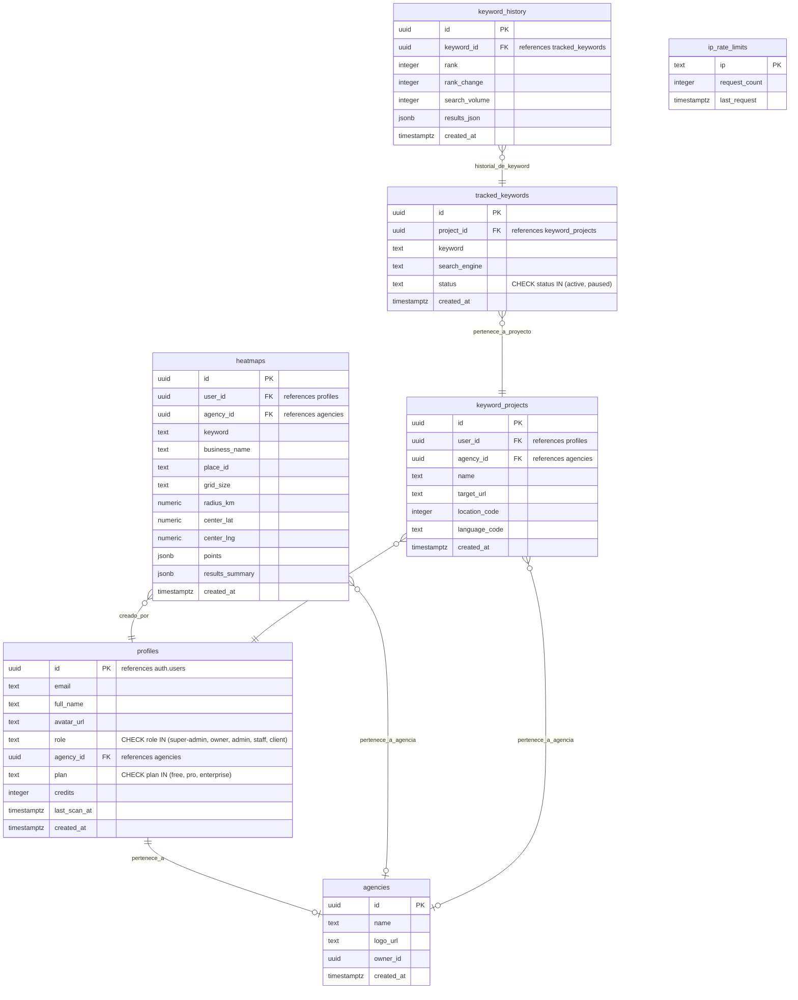

# 🗄️ Esquema de Base de Datos y Seguridad RLS - MapRanker Pro

Este documento detalla la estructura física de la base de datos PostgreSQL alojada en Supabase, las relaciones entre tablas, las políticas de Row Level Security (RLS) y las funciones internas de base de datos para la lógica comercial de **MapRanker Pro**.

---

## 🗺️ Modelo de Relaciones (Entidad-Relación)

A continuación se presenta un resumen visual de la estructura lógica de las tablas:

---

## 📋 Detalle de Tablas

### 1. `agencies`
Almacena las organizaciones del sistema Multi-Tenant para Marca Blanca.
*   `id` (UUID, PK): Identificador único de la agencia.
*   `name` (TEXT): Nombre comercial de la agencia.
*   `logo_url` (TEXT, Nullable): URL del logo personalizado.
*   `owner_id` (UUID): Identificador del usuario creador/dueño (role: `owner`).
*   `created_at` (TIMESTAMPTZ): Marca de tiempo de creación.

### 2. `profiles`
Extensión de la tabla interna de autenticación `auth.users` mediante un trigger automático.
*   `id` (UUID, PK): Referencia uno a uno con `auth.users(id)`.
*   `email` (TEXT): Correo electrónico del usuario.
*   `full_name` (TEXT, Nullable): Nombre del usuario.
*   `avatar_url` (TEXT, Nullable): Enlace a la imagen del avatar.
*   `role` (TEXT): Rol del usuario (`super-admin`, `owner`, `admin`, `staff`, `client`).
*   `agency_id` (UUID, FK, Nullable): Agencia a la que pertenece el usuario (referencia a `agencies(id)`).
*   `plan` (TEXT): Plan de suscripción (`free`, `pro`, `enterprise`).
*   `credits` (INTEGER): Créditos comerciales disponibles para ejecutar búsquedas.
*   `last_scan_at` (TIMESTAMPTZ, Nullable): Fecha del último escaneo.
*   `created_at` (TIMESTAMPTZ): Fecha de registro.

### 3. `heatmaps`
Almacena el historial y la configuración de los mapas de calor locales ejecutados.
*   `id` (UUID, PK): Identificador del mapa.
*   `user_id` (UUID, FK): Perfil del usuario que inició la búsqueda.
*   `agency_id` (UUID, FK, Nullable): Agencia que es dueña del escaneo (permite compartir datos en el equipo).
*   `keyword` (TEXT): Término local buscado (ej: "veterinario").
*   `business_name` (TEXT): Nombre comercial objetivo del mapa de calor.
*   `place_id` (TEXT, Nullable): Google Place ID de la ficha.
*   `grid_size` (TEXT): Tamaño de la cuadrícula simulada (ej: "3x3", "5x5", "7x7").
*   `radius_km` (NUMERIC): Radio de la búsqueda en kilómetros.
*   `center_lat` (NUMERIC): Latitud GPS del punto central de escaneo.
*   `center_lng` (NUMERIC): Longitud GPS del punto central de escaneo.
*   `points` (JSONB): Matriz de objetos con posiciones GPS y rankings encontrados en cada coordenada.
*   `results_summary` (JSONB): Métricas agregadas (Share of Local Vision - SoLV, ranking promedio, etc.).
*   `created_at` (TIMESTAMPTZ): Fecha de ejecución.

### 4. `keyword_projects`
Proyectos creados para el análisis de palabras clave y seguimiento orgánico local.
*   `id` (UUID, PK): Identificador único del proyecto.
*   `user_id` (UUID, FK): Creador del proyecto.
*   `agency_id` (UUID, FK, Nullable): Agencia a la que está vinculado el proyecto.
*   `name` (TEXT): Nombre del proyecto (ej: "Peluquerías Madrid").
*   `target_url` (TEXT, Nullable): Dominio del sitio web a rastrear (ej: `narbossalon.com`).
*   `location_code` (INTEGER, Nullable): Código de ubicación geográfica de DataForSEO.
*   `language_code` (TEXT): Código de idioma configurado (ej: `es`).
*   `created_at` (TIMESTAMPTZ): Fecha de creación.

### 5. `tracked_keywords`
Palabras clave individuales vinculadas a un proyecto de seguimiento.
*   `id` (UUID, PK): Identificador de la keyword.
*   `project_id` (UUID, FK): Proyecto asociado.
*   `keyword` (TEXT): Palabra clave monitoreada (ej: "peluqueria madrid").
*   `search_engine` (TEXT): Motor de búsqueda (por defecto `google`).
*   `status` (TEXT): Estado de monitorización (`active`, `paused`).
*   `created_at` (TIMESTAMPTZ): Fecha de inserción.

### 6. `keyword_history`
Registro histórico de rankings y volúmenes de búsqueda de las palabras clave rastreadas en el tiempo.
*   `id` (UUID, PK): Identificador único del evento de ranking.
*   `keyword_id` (UUID, FK): Keyword rastreada.
*   `rank` (INTEGER, Nullable): Posición orgánica encontrada (Top 100).
*   `rank_change` (INTEGER): Variación de posición frente al escaneo anterior.
*   `search_volume` (INTEGER, Nullable): Volumen mensual de búsqueda.
*   `results_json` (JSONB, Nullable): Payload con detalles crudos de la SERP.
*   `created_at` (TIMESTAMPTZ): Fecha del análisis.

### 7. `ip_rate_limits`
Tabla de seguridad para mitigar ataques de denegación de servicio (DDoS) y consumos maliciosos sin autenticar.
*   `ip` (TEXT, PK): Dirección IP del cliente.
*   `request_count` (INTEGER): Total de solicitudes en la ventana.
*   `last_request` (TIMESTAMPTZ): Fecha de la última llamada.

---

## 🔒 Políticas de Row Level Security (RLS)

La base de datos cuenta con políticas de RLS sumamente estrictas para aislar los datos entre diferentes agencias de marca blanca (*Multi-Tenant Isolation*) y permitir al SuperAdmin auditar todo el sistema.

### Funciones de Seguridad Auxiliares
*   **`internal.is_super_admin()`**:
    - **Esquema**: `internal` (aislado del esquema público para evitar que clientes maliciosos ejecuten llamadas directas vía API REST).
    - **Seguridad**: `SECURITY DEFINER` (se ejecuta con los permisos del creador del trigger/función para poder consultar `profiles`).
    - **Lógica**: Devuelve `true` si el perfil del usuario autenticado (`auth.uid()`) tiene el rol `super-admin`.
    - **Acceso**: Solo los roles `authenticated` y `service_role` pueden ejecutarla; denegada a usuarios anónimos (`anon`).

### Resumen de Políticas RLS por Tabla

| Tabla | Operación | Tipo / Rol | Condición de Acceso |
|---|---|---|---|
| **`agencies`** | `ALL` | `service_role` / `super-admin` | `internal.is_super_admin()` |
| | `SELECT` | `authenticated` | `owner_id = auth.uid()` |
| **`profiles`** | `SELECT` / `UPDATE` | `service_role` / `super-admin` | `internal.is_super_admin()` |
| | `SELECT` / `UPDATE` | `authenticated` | `auth.uid() = id` |
| **`heatmaps`** | `SELECT` | `super-admin` | `internal.is_super_admin()` |
| | `SELECT` | `authenticated` | `auth.uid() = user_id` |
| | `SELECT` | `authenticated (Agencia)` | `agency_id IN (SELECT agency_id FROM profiles WHERE id = auth.uid() AND role IN ('owner', 'admin', 'staff'))` |
| | `INSERT` / `DELETE` | `authenticated` | `auth.uid() = user_id` (Con validación previa) |
| **`keyword_projects`** | `SELECT` / `INSERT` / `DELETE` | `authenticated` | `auth.uid() = user_id` |
| **`tracked_keywords`** | `SELECT` / `INSERT` / `DELETE` | `authenticated` | `project_id IN (SELECT id FROM keyword_projects WHERE user_id = auth.uid())` |
| **`keyword_history`** | `SELECT` | `authenticated` | `keyword_id IN (SELECT tk.id FROM tracked_keywords tk JOIN keyword_projects kp ON tk.project_id = kp.id WHERE kp.user_id = auth.uid())` |
| **`ip_rate_limits`** | `ALL` | `service_role` (Edge Functions) | `true` (Habilitado únicamente para llamadas internas seguras) |

---

## ⚡ Funciones y Triggers del Servidor

### 1. Trigger `on_auth_user_created`
*   **Función vinculada**: `public.handle_new_user()` (`SECURITY DEFINER`).
*   **Evento**: `AFTER INSERT` en `auth.users`.
*   **Acción**: Inserta de forma automática un perfil en `public.profiles` utilizando los metadatos proporcionados en la creación del usuario (email, nombre, avatar y rol asignado).

### 2. Función `public.check_and_deduct_credits(p_user_id, p_cost, p_min_seconds_between_scans)`
*   **Propósito**: Controlar de forma atómica y transaccional el cobro de créditos de una consulta de mapa de calor antes de lanzar llamadas a APIs externas costosas, impidiendo además el spam con un límite temporal entre escaneos.
*   **Seguridad**: `SECURITY DEFINER` (se ejecuta en el search path `public`).
*   **Restricción Crítica**: **REVOKED ALL TO PUBLIC/AUTHENTICATED**. Solo el rol `service_role` (que ejecutan las Edge Functions en la nube) tiene el permiso de ejecución (`GRANT EXECUTE TO service_role`). Esto impide que los clientes alteren sus créditos enviando solicitudes directas a través del SDK del frontend.
*   **Lógica**:
    1. Obtiene los créditos actuales y la fecha del último escaneo del perfil del usuario bloqueando la fila para actualización (`FOR UPDATE`).
    2. Si los créditos son inferiores al costo de la solicitud (`p_cost`), interrumpe y devuelve un error: `'INSUFFICIENT_CREDITS'`.
    3. Si el tiempo transcurrido desde el último escaneo es inferior a `p_min_seconds_between_scans`, interrumpe para mitigar abusos concurrentes: `'TEMPORAL_LIMIT'`.
    4. Resta el costo de los créditos, actualiza la fecha `last_scan_at` y devuelve un JSON de éxito con los créditos restantes.
